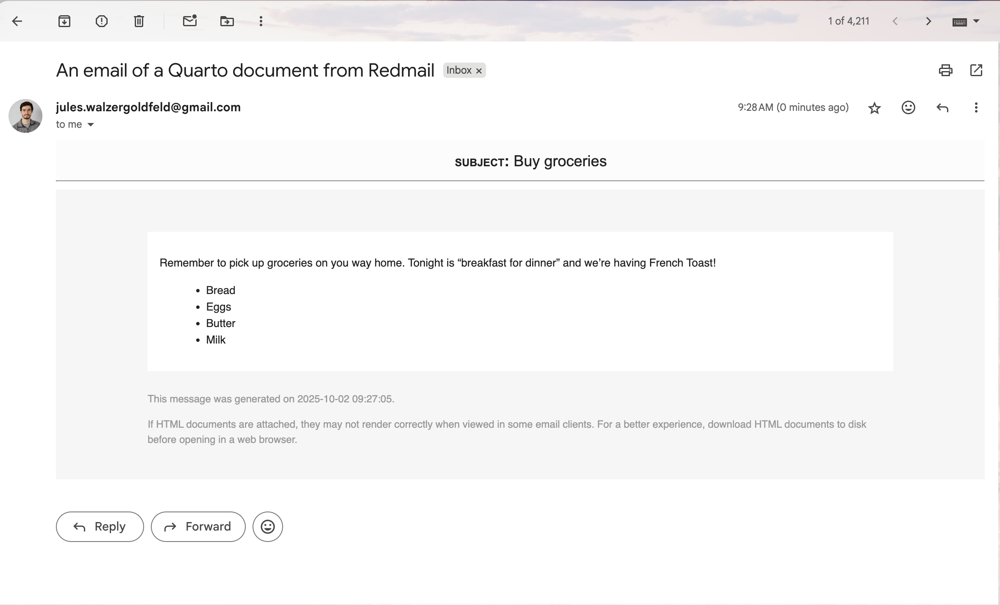

# What the "quarto-email" sub-directory is for

This sub-directory features a quarto document (quarto-email-demo.qmd) featuring the format: email field. Then there is an email block, which allows us to run the following to produce a preview at `email-preview/index.html`:

```sh
uv run quarto render quarto-email-demo.qmd
```

We can also upload such a quarto document to connect, and send the file via connect, at which point it will be converted to the email html that we achieved above before sending at some scheduled interval.

Altenatively, we can send the generated `email-preview/index.html` as the body of any other email, which `main.py()` does with the **Redmail** library.

